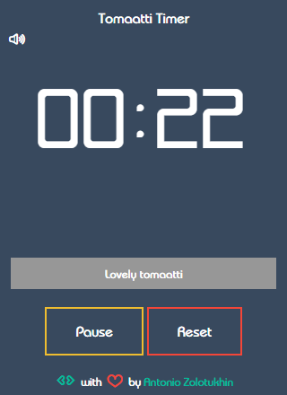

# Tomaatti Timer

Tomaatti (Finnish for tomato) is a Pomodoro timer :tomato: that makes it easier for anyone to get started with the [Pomodoro Technique &reg;](https://francescocirillo.com/pages/pomodoro-technique) .

## What? :confused: Yet another stupid Pomodoro timer?

Hey, it's not stupid at all! :grinning:. Just don't hesitate - give it a try. I bet, you will like it!

There are not so many projects on GitHub with Pomodoro timers that force you to commit the murder of their authors after several minutes of use. After several days of investigation, I felt like I'm over it and I need something different.

This project was born as the result of my stydying JavaScript and I expect it to grow into a fully-featured product, as my knowledge evolve. I have a more or less clear roadmap of incremental improvements :chart_with_upwards_trend: some of which should make a real difference and stand out :rocket: _Tomaatti Timer_ from the rest of existing Pomodoro timers (yeah, I guess your reaction :satisfied: :trollface:).

The ultimate goal behind the idea of creating _Tomaatti Timer_ was not "yet another ephemeral Pomodoro timer" but rather a product with usefullness in mind, so that other people would like to use and can easily [contribute](#contributing) to.

## Getting started

The instructions below will help you to get the copy of the project up and running on your local machine for development and/or teating purposes.

### Prerequisites

1. [`git`](https://git-scm.com). As you are already using GitHub (aren't you? :wink:), I expect you to have git installed on your machine and I also expect that you are familiar with basic `git` commands and flows. If not, feel free check [this guide](https://guides.github.com/activities/hello-world/). 
1. [`npm`](https://docs.npmjs.com). Node.js package manager is used to install, launch, and manage different packages within the project. If you need more info on how to use npm, check [this guide](https://nodesource.com/blog/an-absolute-beginners-guide-to-using-npm/).

### Installing

Open your terminal and execute the following commands:

```bash
git clone https://github.com/bandantonio/tomaatti-timer.git
cd tomaatti-timer
npm i
npm run styles
npm run serve
```

Open your browser and navigate to `http://localhost:8088`.

Bingo! :tada:

### Screenshots

 

 

### Features

The initial version (0.1.0) of the Tomaatti Timer has the following features:

* configurable timer intervals (cycle, short and long breaks)
* ticking sound (optional)

### Roadmap

Below is a plan for further improvements:

1. Pause functionality :question:
1. Sounds for start/end of each cycle
1. Popup notifications
1. Keyboard shortcuts
1. List of completed tomaatti :question:
1. Set goals
1. Statistics (total number of completed cycles)
1. Number of pauses
1. Themes
1. Applications
1. Integrations

### Technical improvements

1. Write tests (unit, integration, e2e)
1. Write documentation
1. Refactor code to make it easier to follow

## Contributing

The project is on its early stages of development, so any kind of contribution (including :star:) is welcome. Please read [CONTRIBUTING.md](CONTRIBUTING.md) for more details.

## Community

The Tomaatti Timer community is dedicated to providing a safe, inclusive, welcoming, and harassment-free space and experience for all community participants, regardless of gender identity and expression, sexual orientation, disability, physical appearance, socioeconomic status, body size, ethnicity, nationality, level of experience, age, religion (or lack thereof), or other identity markers. Our Code of Conduct exists because of that dedication, and we do not tolerate harassment in any form. See our full Code of Conduct [here](CODE_OF_CONDUCT.md).

## Versioning

Tomaati Timer receives its versions according to [SemVer](http://semver.org/).

## License

[MIT](LICENSE). &copy; 2019, [Antonio Zolotukhin](https://mister-gold.pro).